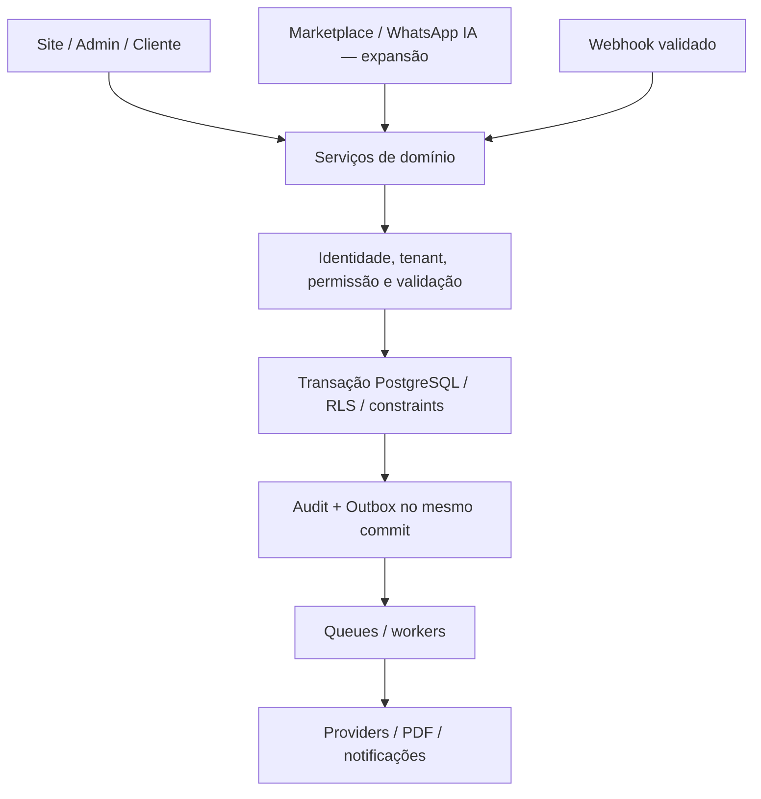

# Arquitetura

Fonte: F.4, F.7–F.9 e G.1.10–11/47–53. Aplicar [AUDIT_G1.md](AUDIT_G1.md) e [DECISIONS.md](DECISIONS.md).

## Topologia e stack

Uma aplicação, um repositório, um backend e banco multi-tenant. Sem instalação por agência, microserviços obrigatórios ou SPA/API independentes no MVP.

| Camada | Decisão da conversa |
|---|---|
| Web | Next.js App Router, React, TypeScript strict |
| UI | Tailwind CSS 4, shadcn/ui, CSS variables para branding |
| Formulários | React Hook Form + Zod 4 |
| Estado | Server Components, URL state e React state; TanStack Query quando necessário |
| Dados | Supabase PostgreSQL, Auth e Storage; Supabase JS, SQL e tipos gerados |
| Escritas críticas | Domain Services + transações/RPC PostgreSQL |
| Webhooks | Supabase Edge Functions finas |
| Assíncrono | Outbox + Supabase Queues + Supabase Cron |
| Editor | Tiptap ou equivalente por abstração; conteúdo estruturado |
| PDF/assinatura | PdfRenderer separado de SignatureProvider |
| Testes | Vitest, PostgreSQL/Supabase local real, Playwright |
| CI | GitHub Actions |
| Pacotes | pnpm e lockfile versionado |
| Hospedagem prevista | Vercel para app; Supabase Cloud para serviços |

F.4 cita Next.js 16.3+/React 19 e Node LTS. As afirmações históricas sobre patches e versões disponíveis não foram revalidadas nesta consolidação. PHASE_00 deve consultar documentação oficial, verificar disponibilidade e compatibilidade e registrar versões exatas no lockfile, engines e registro de decisão. Não instalar um número inexistente nem atualizar major silenciosamente. A escolha arquitetural permanece Next.js/React/Supabase.

## Estrutura a implementar em PHASE_00

```text
src/
  app/                 # site, cliente, painel e plataforma
  components/          # componentes compartilhados
  modules/
    agencies/ trips/ reservations/ customers/
    payments/ contracts/ operations/ finance/
    affiliates/ marketplace/
  lib/                 # auth, tenant, money, erros e observabilidade
  providers/           # adapters de terceiros
supabase/
  migrations/
  functions/
  seed.sql
  config.toml
tests/
  unit/
  integration/
  security/
  e2e/
docs/
codex/
```

O pacote documental não cria package.json nem finge conter uma aplicação executável. PHASE_00 materializa essa árvore com dependências verificadas.

## Fronteiras



Server Actions e Route Handlers só recebem, validam e delegam. Regras críticas não ficam no React nem são duplicadas em Edge Functions. Edge Functions e runtime web devem compartilhar contratos e usar fronteira transacional que não dependa de bibliotecas incompatíveis com o runtime.

Banco protege concorrência e integridade; serviços organizam regras e integrações. Não realizar chamadas externas demoradas segurando locks de assento. Persistir intenção idempotente, realizar efeito externo e reconciliar confirmação com retry seguro.

## Contratos dos serviços

# F.7 APIs internas e contratos entre módulos

A regra principal será: **nenhuma interface externa ou tela acessa regras críticas diretamente no banco**. O sistema terá uma camada de serviços de domínio.

O fluxo padrão será:

```text
UI / API / WhatsApp / Marketplace
              ↓
         Domain Service
              ↓
      validação + permissão
              ↓
      transação de negócio
              ↓
 PostgreSQL / RLS / Constraints
              ↓
       Audit + Outbox
```

Isso significa que site, painel administrativo e futuramente WhatsApp usam **o mesmo motor de negócio**.

Por exemplo, todos estes canais:

```text
Site
Admin
WhatsApp AI
Marketplace
```

chamam essencialmente:

```text
ReservationService
PricingService
SeatService
PaymentService
ContractService
CancellationService
```

Não teremos uma lógica diferente para cada canal.

## ReservationService

Será responsável por operações como:

```text
createDraft()
setBuyer()
addPassenger()
removePassenger()
setBoardingPoint()
setPassengerPrice()
submitForEntry()
confirm()
expire()
cancelPassenger()
cancelReservation()
transferBuyer()
replacePassenger()
```

Mas funções extremamente críticas podem terminar em RPC transacional no PostgreSQL.

Exemplo:

```text
ReservationService.confirm()
        ↓
confirm_reservation(...)
```

Assim protegemos a operação mesmo contra concorrência.

## SeatService

Responsabilidades:

```text
getAvailability()
holdSeat()
releaseHold()
assignSeat()
releaseSeat()
migrateVehicleSeats()
```

A operação de hold deve ser atômica.

Algo conceitualmente como:

```text
holdSeat(
  agency_id,
  trip_id,
  seat_id,
  reservation_id,
  passenger_id,
  expires_at
)
```

Se duas requisições chegarem juntas:

```text
Pessoa A → assento 12
Pessoa B → assento 12
```

uma vence e a outra recebe conflito de disponibilidade.

Nunca duas confirmações.

## PricingService

O preço final não será calculado por componentes React.

Teremos algo do tipo:

```text
calculatePassengerPrice()
calculateReservationPrice()
validateDiscount()
```

Considerando:

```text
categoria
preço da viagem
desconto
aprovação
origem comercial
```

O resultado usado na criação da reserva vira snapshot.

## PaymentPricingEngine

Separado do preço turístico.

Entrada:

```text
agency_id
trip_id
channel
provider
method
installments
base_amount
```

Saída:

```text
base_amount
provider_fee
fee_bearer
client_fee
agency_fee
customer_total
```

Exemplo:

```text
Preço da viagem             R$ 1.000
Taxa cartão                 R$    45

CLIENT

Cliente paga                R$ 1.045
Receita turística           R$ 1.000
```

Nunca:

```text
Receita da viagem = R$ 1.045
```

só porque houve taxa financeira.

## PaymentService

Operações:

```text
createPayment()
registerCashPayment()
processProviderConfirmation()
allocatePayment()
refund()
reverse()
reconcile()
```

O provider não altera reserva diretamente.

Fluxo correto:

```text
Mercado Pago webhook
↓
MercadoPagoProvider
↓
evento normalizado
↓
PaymentService
↓
regra financeira
↓
ReservationService se necessário
```

Isso mantém Mercado Pago fora das nossas regras comerciais.

## ContractService

Responsabilidades:

```text
generateContract()
renderPdf()
publishTemplateVersion()
createAdditionalDocument()
sendForSignature()
registerSignatureResult()
```

A reserva fornece os dados. O Contract Engine gera o documento.

Nada de contrato construído diretamente no componente do checkout.

## CancellationService

Receberá algo como:

```text
simulateCancellation()
requestCancellation()
approveException()
executeCancellation()
```

A simulação e a execução precisam utilizar a **mesma regra de cálculo**, para não acontecer:

```text
Tela mostrou reembolso de R$ 500
↓
execução devolveu R$ 430
```

sem alteração de contexto.

## FinancialClosureService

Terá:

```text
calculate()
validate()
close()
reopen()
```

O `calculate()` pode ser executado várias vezes.

O `close()` cria snapshot oficial.

## MarketplaceService

Fase 2, mas contrato definido desde agora:

```text
publishTrip()
unpublishTrip()
createMarketplaceReservation()
registerMarketplaceSale()
createPayout()
completePayout()
```

E reforço a regra:

```text
Mercado Pago Marketplace
CONFIRMED
        ↓
Reserva da agência
CONFIRMED
```

Repasse não participa dessa decisão.

## Contrato comum de comandos

Detalhamento técnico deste pacote, coerente com F.7: cada comando recebe contexto autenticado (ator, agência validada, request_id), entrada validada e chave idempotente quando houver efeito financeiro/comercial. Respostas retornam referência da entidade, resultado/versionamento e erro de domínio sanitizado. Nomes finais de DTOs são definidos na fase correspondente.

Erros precisam distinguir falta de autenticação, acesso negado, entrada inválida, conflito de capacidade/estado e indisponibilidade do provider. Interface mostra orientação útil sem SQL, stack trace, PII ou segredo.

| Operação | Pré-condição | Garantia |
|---|---|---|
| holdSeat / hold de capacidade | Viagem elegível, passageiro e assento do tenant | No máximo um compromisso ativo por lugar; capacidade global preservada |
| confirmReservation | Entrada quitada, reserva elegível e hold/capacidade revalidado | Holds convertidos, estado, audit e outbox coerentes |
| processProviderConfirmation | Evento autenticado, conta e valor reconciliados | Sem duplicação de pagamento/alocação |
| executeCancellation | Política/snapshot e eventual aprovação válidos | Libera só vagas afetadas e registra resolução financeira |
| debit wallet | Crédito do mesmo tenant e saldo elegível | Sem gasto concorrente duplicado |
| close | Prévia atual e dados consistentes | Snapshot versionado e obrigações sem duplicação |
| reopen | Permissão, motivo e autenticação recente | Histórico preservado; ajustes de obrigações já pagas |

## Dinheiro, tempo e consistência

numeric(14,2) no banco; Decimal ou equivalente tipado no domínio. No transporte JSON usar representação exata e validar; não converter para number no caminho de cálculo. Adapters convertem para centavos conforme contrato externo.

Nascimento é date. Instantes são timestamptz/UTC e exibidos no timezone da agência. Idade é calculada na data da viagem. Prazos comerciais e policies são congelados quando necessário; mudança de timezone não reinterpreta vendas antigas.

## Domínios e cache

Site resolve tenant por hostname verificado; Admin central em app.plataforma.com; Auth em auth.plataforma.com. Nomes são ilustrativos. Marketplace tem contexto próprio futuro. Cache público deve incluir tenant/hostname e versão de publicação; cache privado não pode vazar entre usuários ou agências. Invalidar mudanças de publicação/preço e revalidar preço/capacidade no backend.

## Ambientes, deploy e observabilidade

Separar LOCAL, STAGING e PRODUCTION; projetos Supabase distintos para staging/produção. Seed fictício com duas agências para testes, Admin/Analyst/clientes e viagem demo. Nunca copiar PII real para dev.

Logs estruturados: timestamp, nível, request_id, actor_type, agency_id quando seguro, operação, entity_id e error_code. Logs técnicos do Super Admin são sanitizados.

Deploy previsto usa migrations revisadas, backup e plano de recuperação; restauração precisa cobrir banco e arquivos críticos. Bootstrap deve documentar variáveis realmente exigidas; nenhuma credencial real entra no Git. Feature flags mantêm expansão desativada, sem desligar RLS/permissões.
